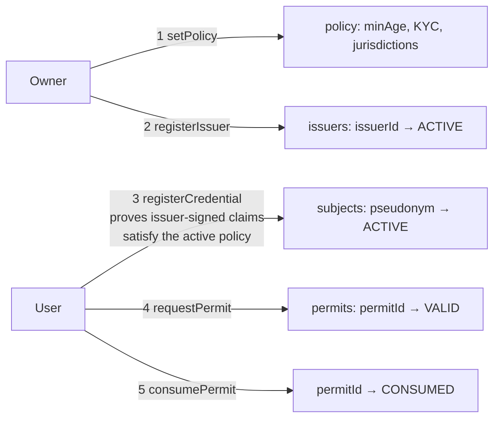
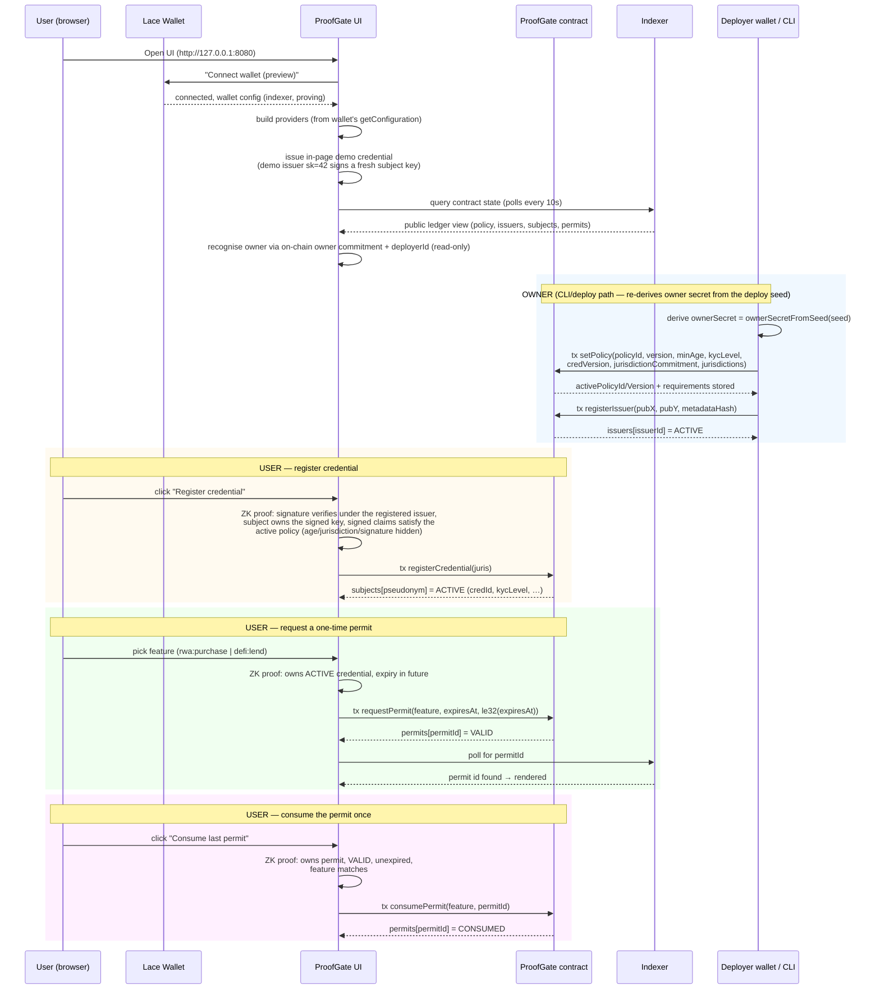
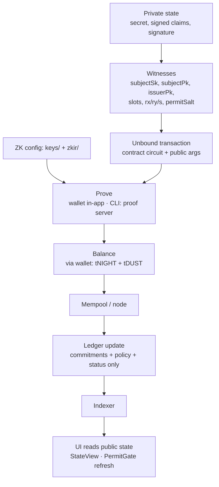

# ProofGate — Project Guide

**Privacy-preserving compliance gateway on the Midnight blockchain.**

ProofGate lets a user prove they are *eligible* — "I am 18+, I am in an allowed
jurisdiction, I passed KYC, I hold an issuer-signed credential" — without
proving *who* they are. Every action is a zero-knowledge proof; the ledger only
ever stores hash commitments, policy parameters and status flags.

This document covers the **architecture**, **workflow**, **user flow**, and
**data flow** of the project.

---

## 1. System Architecture

```
┌────────────────────────────────────────────────────────────────────────────┐
│                            BROWSER (Web UI)                                │
│                                                                            │
│  ┌──────────────┐   ┌────────────────────┐   ┌──────────────────────────┐ │
│  │ WalletConnect │   │     PermitGate      │   │        StateView        │ │
│  │ (Lace connect)│   │ (main ZK user flow) │   │ (read-only ledger view) │ │
│  └──────┬───────┘   └─────────┬──────────┘   └────────────┬─────────────┘ │
│         │                    │                            │               │
│  ┌──────▼───────┐   ┌────────▼─────────┐   ┌──────────────▼─────────────┐ │
│  │ useMidnight  │   │ contract.ts       │   │ env.ts (indexer URL)      │ │
│  │ (conn store) │   │ deploy/connect    │   └────────────┬─────────────┘ │
│  └──────────────┘   └────────┬─────────┘                │                │
│                              │                          │                │
│                    ┌─────────▼─────────┐       ┌────────▼────────────┐    │
│                    │ lib/proofgate.ts  │       │ indexerPublicData   │    │
│                    │  v3 private state │       │ Provider (polling)  │    │
│                    │  + witnesses      │       └────────┬────────────┘    │
│                    └─────────┬─────────┘                │                 │
│                    ┌─────────▼─────────┐                 │                 │
│                    │ lib/schnorr.ts    │                 │                 │
│                    │ browser signing  │                 │                 │
│                    │ (demo issuer)    │                 │                 │
│                    └──────────────────┘                 │                 │
└──────────────────────────────┼──────────────────────────┼─────────────────┘
         in-app proving         │                          │ read public state
   (wallet generates the ZK    │                          │
    proof, balances & submits) │                          │
                               │                          │
┌──────────────────────────────┼──────────────────────────┼─────────────────┐
│                       MIDNIGHT NETWORK                   │                 │
│  ┌──────────────┐  ┌─────────▼────────┐   ┌─────────────▼──────────────┐  │
│  │  Lace Wallet  │  │  Midnight Node   │   │        Indexer             │  │
│  │  (proves,     │  │  (mempool,       │   │  (graphQL API + WS pubsub) │  │
│  │  signs,       │  │  consensus,      │   └────────────────────────────┘  │
│  │  balances)    │  │  ledger)         │                                  │
│  └──────────────┘  └──────────────────┘                                   │
└────────────────────────────────────────────────────────────────────────────┘

┌────────────────────────────────────────────────────────────────────────────┐
│                          NODE / CLI (Alternative)                           │
│                                                                            │
│  cli.ts ──► deploy.ts / setup.ts ──► wallet.ts (WalletFacade SDK)          │
│  proofgate.ts + schnorr.ts (private state & crypto) ──► midnight-js        │
│      └─► httpClientProofProvider ──► PROOF SERVER (local Docker, :6300)    │
│      └─► indexerPublicDataProvider ──► Indexer (Preview :443 / devnet :8088)│
│      └─► levelPrivateStateProvider ──► on-disk encrypted private state      │
│                                                                            │
│  Preview (CLI):  rpc.preview.midnight.network · indexer.preview.midnight.network · local proof server (:6300)
│  Local devnet:   node (:9944)  ·  indexer (:8088)  ·  proof (:6300)        │
└────────────────────────────────────────────────────────────────────────────┘
```

### Component map

| Layer | Component | Responsibility |
|---|---|---|
| Contract | `contracts/proofgate.compact` | The ProofGate smart contract in Compact (17 exported circuits: 11 state-mutating, 3 in-circuit predicates, 3 pure commitment helpers) |
| Contract (compiled) | `managed/proofgate/` | Compiler output: `contract/` (TS bindings), `keys/` (prover/verifier keys), `zkir/` (ZK circuits) |
| Shared crypto | `src/schnorr.ts` | Schnorr-over-Jubjub credential signing/verification (off-chain mirror of the in-circuit scheme) |
| Shared SDK | `src/proofgate.ts` | Node-side private state model, demo credentials, witness builder, jurisdiction helpers |
| Browser | `frontend/src/lib/schnorr.ts` | Browser copy of `src/schnorr.ts` (imports only compact-runtime + Web Crypto) |
| Browser | `frontend/src/lib/proofgate.ts` | Browser private state, witnesses, in-page demo credential (demo issuer sk = 42) |
| Browser | `frontend/src/components/PermitGate.tsx` | Core user flow: activate policy, register issuer/credential, request/consume permit |
| Browser | `frontend/src/components/WalletConnect.tsx` | Connect/disconnect the Lace wallet |
| Browser | `frontend/src/components/StateView.tsx` | Read-only public-ledger panel (polls indexer every 10 s) |
| Browser | `frontend/src/hooks/useMidnight.ts` | Wallet discovery + connection state store (module-level) |
| Browser | `frontend/src/lib/providers.ts` | Builds Midnight providers from the wallet's own `getConfiguration()` |
| Browser | `frontend/src/lib/contract.ts` | `deployContract` / `findDeployedContract` wiring |
| CLI | `src/cli.ts` | `info`, `set-policy`, `register-issuer`, `transfer-ownership`, `register-credential`, `request-permit`, `consume-permit`, `demo` |
| CLI | `src/deploy.ts` | Non-interactive deploy (uses proof server for ZK) |
| CLI | `src/wallet.ts` | Wallet SDK facade, network-ID configuration |
| CLI | `src/network.ts` | Network configs (`undeployed`/`preview`/`preprod`), state file, BIP-39 wallet management |
| Tests | `tests/proofgate.test.ts` | 50 headless contract tests (no Docker / proof server) |
| Tests | `tests/schnorr-prototype.test.ts` | 6 Schnorr prototype sanity tests |
| Infra | `compose.yml` | Local devnet: node, indexer, proof-server |

---

## 2. Roles & Privacy Model

There are four actors. Pseudonyms, commitments, policy parameters and status
flags are **public**; identities, ages, jurisdictions, secrets and signatures
are **private**.

| Role | Public (on-chain) | Private (witness-only) |
|---|---|---|
| **Owner** (deployer) | `owner` — commitment of the owner secret; `deployerId` — identity of the deploy wallet | the owner secret itself |
| **KYC issuer** | `issuerId` (persistentHash of its public key) → `Issuer{status, pkX, pkY, metadataHash, …}` | the issuer secret key |
| **Subject** (end user) | pseudonym `subjectKey(domain, pk)` → `Subject{status, credId, issuerId, kycLevel, policyVersion, expiresAt, registeredAt}` | `subjectSk`, raw public keys, signed claims (`age`, `jurisdiction`, KYC, times, versions), Schnorr signature `R`/`s`, credential id |
| **Permit** | `permitId`, holder pseudonym, feature, policyId, expiry, `VALID`/`CONSUMED`/`REVOKED` | per-permit `permitSalt` (makes permit ids unlinkable) |

> **Privacy invariant:** an observer sees "pseudonym X holds a VALID permit for
> feature F until T, under policy P" — never *who* X is. The credential's
> signature is verified **in-circuit** and never written to the ledger; the
> chain stores only the *subject commitment* (pseudonym) and the *credential
> id* (a revocation handle).

### The credential document

A user's eligibility is an **off-chain Schnorr signature** from a registered KYC
issuer over an 18-slot, domain-separated message (`src/schnorr.ts`,
`challengeVector` — byte-for-byte identical to `schnorrChallenge` in the
contract):

```
0  domain tag (ProofGateSchnorr:v1)   9  credentialId (revocation id)
1  R.x   2 R.y  (signature nonce)     10 credentialVersion     15 expiresAt
3  issuerPkX   4 issuerPkY            11 ageClaim (hidden)     16 policyVersion
5  issuerId (commitment)              12 jurisdiction (hidden) 17 contractDomain
6  subjectPkX  7 subjectPkY            13 kycLevelClaim
8  subjectCommitment (pseudonym)      14 issuedAt
```

The signature covers every security-critical field: claims, expiry, issuer and
subject identity, policy reference and instance domain. The circuits verify it
without ever disclosing it.

---

## 3. Workflow

### 3.1 Setup / deployment workflow

```mermaid
flowchart TD
    A[Install Node 22+] --> B[npm install]
    B --> C[npm run compile]
    C --> D{Client}
    D -->|CLI - preview / preprod| G[local proof server via Docker - optional, CLI-only]
    G --> H[wallet auto-created / reused]
    H --> I[fund via faucet: tNIGHT + tDUST]
    I --> J[contract deployed, address saved to .midnight-state.json]
    J --> O[owner = commitment of ownerSecretFromSeed(seed)<br/>deployerId recorded on-chain]
    D -->|CLI - undeployed local devnet| E[docker compose up -d]
    E --> F[npm run deploy -- --network undeployed]
    O --> K[CLI owner bootstrap: set-policy + register-issuer<br/>(owner secret re-derived from the seed)]
    K --> M[Web UI: point VITE_CONTRACT_ADDRESS at address]
    M --> N[user: register credential / request permit / consume permit in browser<br/>(ZK proofs via local proof server)]
```

1. **Compile** — `npm run compile` (`compact compile contracts/proofgate.compact
   managed/proofgate`) generates TypeScript bindings (`contract/`), ZK circuits
   (`zkir/`) and keys (`keys/`).
2. **Deploy** (`src/deploy.ts`) — picks a network, creates/restores a wallet,
   waits for sync, ensures tNIGHT + tDUST, waits for the proof server, then calls
   `deployContract(providers, { args: [contractDomain, owner, deployerId] })`. The
   canonical domain is `DEFAULT_DOMAIN = pad32("ProofGate:canonical:test:v1")`.
   The owner is the commitment of an owner secret derived from the deploy wallet
   seed (`ownerSecretFromSeed(seed)`), so the deployer is the initial owner and
   the secret is reproducible from the seed for every owner action.
3. The constructor stores `contractDomain`, the owner commitment (`owner`) and
   the deployer identity (`deployerId`) on-chain. **All demo credentials are
   bound to `DEFAULT_DOMAIN`**, so a fresh page session or CLI demo works
   against any standard deployment.
4. **Owner bootstrap** — the deployer activates a policy and registers the demo
   issuer through the CLI (`npm run cli -- set-policy …`, `npm run cli --
   register-issuer …`), because the browser cannot reproduce the seed-derived
   owner secret. The **Web UI is Preview-first and needs no deploy** — point
   `VITE_CONTRACT_ADDRESS` at the new deployment; it discovers the contract and
   recognises the owner/deployer from the public `owner` commitment and
   `deployerId`.

### 3.2 Contract lifecycle (happy path)



Each step is a separate transaction, each producing a zero-knowledge proof. The
demo issuer (sk = 42) is shared by the CLI demo, the headless tests and the
browser app, so the same deployment works end-to-end in all three.

---

## 4. User Flow (end-to-end)

### 4.1 Web UI (browser, Lace wallet)

The browser session builds a **fresh in-memory private state with a random owner
secret** — it can never reproduce the deployer's seed-derived owner secret. It
*can* recognise the deployer/owner through the public deployment identity:
`deployerId` (re-derived from the connected wallet address) and the on-chain
`owner` commitment. Owner-only steps (policy activation, issuer registration)
are therefore executed through the **CLI/deployment path**, which re-derives the
owner secret from the deploy seed; the browser runs the **user** steps.



### 4.2 CLI

```
npm run cli -- info                                     # read-only ledger summary
npm run cli -- set-policy <policyIdHex> [minAge] [kyc]  # owner: activate a policy
npm run cli -- register-issuer <xHex> <yHex>            # owner: register KYC issuer
npm run cli -- transfer-ownership <ownerHex>            # owner: transfer governance
npm run cli -- register-credential                      # user: register credential (ZK)
npm run cli -- request-permit <feature> [expiry]        # user: request one-time permit
npm run cli -- consume-permit <feature> <idHex>         # user: spend the permit once
npm run cli -- demo                                     # full happy-path walkthrough
```

The CLI mirrors the UI flow and proves via a **locally-run official proof server**
(`:6300`, Docker — no hosted public proof server exists). The browser does the
**same**: the Lace wallet's own proving backend cannot prove ProofGate's custom
circuits ("key not found: <circuit>"), so the dApp sets `VITE_PROOF_SERVER_URL`
and proves via `httpClientProofProvider` against the same local proof server
(the wallet still signs, balances, and submits). The CLI keeps private state in
an **encrypted on-disk
LevelDB** (`levelPrivateStateProvider`) rather than memory. The demo flow registers
the **same** demo issuer key the browser uses (sk = 42), so CLI- and browser-deployed
contracts interoperate.

---

## 5. Data Flow

### 5.1 What is private vs public

| Data | Location | Example |
|---|---|---|
| `subjectSk`, `subjectPubX/Y` | wallet private state only | subject keypair (LE field elements) |
| `issuerPubX/Y`, `signedIssuerId` | wallet private state only | the credential's issuer binding |
| `age`, `ageSlot`, `jurisdiction` | wallet private state only | `18n` / `pad32("US")` (demo) |
| `kycLevel`, `issuedAt`, `expiresAt`, versions (values + slots) | wallet private state only | signed claims |
| `rx`, `ry`, `s` | wallet private state only | Schnorr signature |
| `permitSalt` | generated fresh per request | 32 random bytes |
| pseudonym `subjectKey(domain, pk)` | **on-chain** | persistentHash(domain ∥ pk) |
| `owner`, `deployerId` | **on-chain** | persistentHash(owner secret) / persistentHash(deploy wallet address) |
| `credentialId` (revocation id) | **on-chain** (on the Subject record) | fresh random 32 bytes |
| policy (`minimumAge`, `requiredKycLevel`, …) | **on-chain** | `18`, `2`, … |
| `issuers`, `subjects`, `permits`, `revoked` maps | **on-chain** | commitments + statuses |

### 5.2 Ledger schema (public)

```text
contractDomain          : Bytes<32>                 // instance domain (binds credentials)
owner                   : Bytes<32>                 // owner commitment (ownerKey(ownerSecret))
deployerId              : Bytes<32>                 // deployer identity (persistentHash of deploy address)
activePolicyId          : Bytes<32>                 // current policy id (zero before setPolicy)
activePolicyVersion     : Uint<8>                   // current policy version
minimumAge              : Uint<8>                   // minimum eligible age
requiredKycLevel        : Uint<8>                   // minimum KYC level
requiredCredentialVersion: Uint<8>                  // accepted credential schema version
jurisdictionCommitment  : Bytes<32>                 // persistentHash of the 8-slot jurisdiction list
issuers                 : Map<Bytes<32>, Issuer>    // issuerId → { status, pkX, pkY, metadataHash,
                                                     //            createdAt, revokedAt }
subjects                : Map<Bytes<32>, Subject>   // pseudonym → { status, credId, issuerId, kycLevel,
                                                     //            policyVersion, expiresAt, registeredAt }
permits                 : Map<Bytes<32>, Permit>    // permitId → { holder, feature, policyId,
                                                     //            policyVersion, credId, issuedAt,
                                                     //            expiresAt, status }
revoked                 : Set<Bytes<32>>            // revoked credential ids
seq                     : Counter                   // logical event time (registeredAt/issuedAt)
```

### 5.3 Zero-knowledge transaction lifecycle



1. **Witness building** — the circuit reads the private witnesses from the
   wallet's private state (memory in the browser, encrypted LevelDB in the CLI).
   `createWitnesses()` in both builds returns values straight from
   `ctx.privateState`, so one witness set serves any session.
2. **Proving** — the ZK proof is generated either in the Lace wallet (browser)
   or by the remote proof server (CLI). Private inputs never leave this step.
3. **Balancing** — the wallet adds the tNIGHT collateral and tDUST fee UTXOs.
4. **Submission** — the finalized transaction goes to the Midnight node.
5. **Indexing** — the indexer ingests the block; the UI polls it for the new
   public state.

### 5.4 Per-circuit on-chain effect

| Circuit | Private proof asserts | Public write |
|---|---|---|
| `setPolicy` | caller is owner (`ownerKey(secret) == owner`) | active policy + `jurisdictionCommitment` stored |
| `registerIssuer` | caller is owner | `issuers[issuerId] = ACTIVE` (pkX/pkY published) |
| `setIssuerStatus` | caller is owner | `issuers[issuerId].status = SUSPENDED/REVOKED/ACTIVE` |
| `registerCredential` | signature verifies under registered+active issuer, subject owns the signed key, signed claims satisfy the active policy, credential not yet/not expired, jurisdiction ∈ policy list | `subjects[pseudonym] = ACTIVE` |
| `revokeCredential` / `unrevokeCredential` | caller is owner (by credId) | `revoked ∪ {credId}` / `revoked − {credId}` |
| `setSubjectStatus` | caller is owner | `subjects[pseudonym].status = ACTIVE/SUSPENDED/REVOKED` |
| `requestPermit` | owns ACTIVE credential, expiry in future | `permits[permitId] = VALID` (fresh salt → unlinkable id) |
| `consumePermit` | owns the permit, holder matches, feature matches, VALID, unexpired | `permits[permitId] = CONSUMED` |
| `revokePermit` | caller is owner | `permits[permitId] = REVOKED` |
| `transferOwnership` | caller is owner, `newOwner ≠ owner`, `newOwner ≠ 0` | `owner = newOwner` |

Pure helpers (`ownerKey`, `issuerId`, `subjectKey`) compute commitments
off-chain and are mirrored in-circuit. `checkSignature`, `checkPossession` and
`checkCredential` are non-mutating circuit predicates that `registerCredential`
composes in-circuit on chain (and that the SDK also exposes for standalone
off-chain checks). `deployerId` is computed off-chain only (`src/schnorr.ts`)
and is passed to the constructor as a plain argument.

---

## 6. Key Implementation Notes

- **Network-ID configuration** — `@midnight-ntwrk/midnight-js-network-id` must
  be configured before any contract operation. The CLI does this for both the
  ESM and CJS module instances (`src/wallet.ts:59`); the browser calls
  `setNetworkId(NETWORK)` at startup (`frontend/src/main.tsx`).
- **Browser `Buffer` polyfill** — Midnight runtime modules use the bare global
  `Buffer`; `frontend/src/lib/polyfills/buffer.ts` exposes it before anything
  else runs.
- **Single runtime instance** — `@midnight-ntwrk/onchain-runtime-v3` must be
  deduped in the bundle (`frontend/vite.config.ts`) **and** pinned to a single
  hoisted copy on the Node side (`package.json` `overrides` → `3.0.0`),
  otherwise two `StateValue` classes cause `expected instance of _StateValue`
  at runtime on the first contract call.
- **Browser crypto** — `src/schnorr.ts` depends only on
  `@midnight-ntwrk/compact-runtime` and Web Crypto (`crypto.getRandomValues`),
  so it bundles unchanged for the browser as `frontend/src/lib/schnorr.ts`
  (keep the two copies in sync).
- **Demo issuer** — the deterministic issuer sk = 42 (`demoIssuerSk()`) signs
  the CLI demo credential, the headless-test credential, and the in-page demo
  credential (`createDemoPrivateState`). "Register demo issuer" publishes its
  public key in all three contexts. This is a demo convenience — never a fixed
  scalar in production.
- **Witnesses read session state** — `createWitnesses()` (both builds) reads
  every value from `ctx.privateState`, so `CompiledContract.withWitnesses` is
  created once at module load and the actual credential is supplied at
  deploy/connect time.
- **Expiry encoding** — `requestPermit(feature, expiresAt, expiresAtSlot)` takes
  the expiry twice: the `Uint<64>` value and its LE 32-byte slot
  (`le32(expiresAt)`). The circuit proves they are equal.
- **Fees** — public networks need tNIGHT (collateral) and tDUST (fees); the
  deploy flow generates DUST from registered NIGHT UTXOs automatically.
- **Provider model** — the browser builds all providers from the wallet's own
  `getConfiguration()` (indexer, proving, submission), so no endpoints are
  hardcoded for on-chain actions. The read-only ledger view uses `VITE_INDEXER_URL`.
