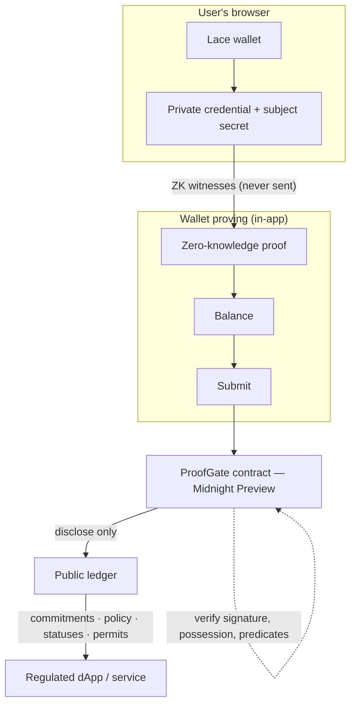
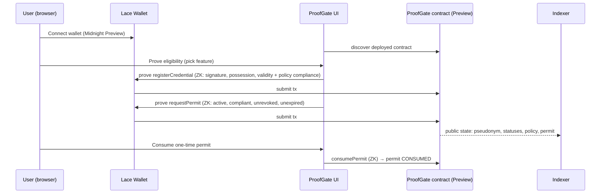

# ProofGate

**A privacy-preserving compliance gateway on the Midnight blockchain.**

ProofGate lets a user prove they are *eligible* — "I am 18+, I am in an allowed
jurisdiction, I passed KYC, I hold an issuer-signed credential" — **without
proving *who* they are**. Every action is a zero-knowledge proof; the Midnight
ledger only ever stores hash commitments, policy parameters and status flags.

[](https://github.com/sudha16-sketc/ProofGate/actions/workflows/ci.yml)
[](https://docs.midnight.network/)
[](https://shields.io/)
[](https://shields.io/)
[](https://shields.io/)
[](https://shields.io/)

---

## Overview

Regulated services must verify that users satisfy compliance requirements —
minimum age, KYC/AML clearance, jurisdiction. Today that means sharing identity
documents and exact personal attributes with every service. ProofGate decouples
**eligibility** from **identity**: a KYC issuer signs a credential (claims about
the user), the user keeps that credential privately in their Midnight wallet,
and the ProofGate contract verifies — **in zero knowledge** — that the signed
claims satisfy the currently active compliance policy. Eligible users receive a
**one-time permit** that third-party dApps can verify and consume.

This is an application project (not a template). See
[PROJECT_GUIDE.md](./PROJECT_GUIDE.md) for the full architecture and data-flow
write-up, [docs/PRODUCT_PROPOSAL.md](./docs/PRODUCT_PROPOSAL.md) for the product
proposal, and [docs/DEMO_SCRIPT.md](./docs/DEMO_SCRIPT.md) for the demo video
script.

## Problem

- Users share sensitive data (ID, exact age, jurisdiction, KYC evidence) with
  every regulated service they touch.
- Each copy is an attack surface: databases leak, processors mishandle data,
  and users permanently lose control of their personal information.
- Services **do** need a trustworthy, enforceable answer to "is this user
  eligible?" — they do **not** need to know *who* the user is.

## Solution

ProofGate is a compliance gateway built on Midnight:

1. An **issuer** (KYC/AML provider) performs its checks off-chain and signs a
   private credential for the user.
2. The user keeps the signed credential **privately in their wallet**.
3. The **ProofGate smart contract** verifies, in zero knowledge, that the
   credential is genuine, current, and satisfies the *active compliance policy*
   (`age ≥ minimumAge`, `kycLevel ≥ requiredKycLevel`, jurisdiction in an
   allowed set).
4. Compliance converts into an **enforceable one-time permit** that regulated
   dApps verify and consume — while the user's identity, exact age,
   jurisdiction and signature never reach the ledger.

## How ProofGate Works

Three deliberately separated ZK circuit groups keep each circuit small:

1. **`registerCredential`** — identity enrollment **and** policy compliance in a
   single proof. Proves the issuer signature, possession of the subject key,
   binding of every signed field, current validity, and that the signed claims
   satisfy the *currently active* policy (age, KYC level, jurisdiction, schema
   + policy version). Stores a commitment to the signed claims.
2. **`requestPermit` / `consumePermit`** — cheap access control gated on the
   registered subject's record and the active policy version, converting
   eligibility into a one-time permit that is consumed exactly once.

Registration never repeats when policy changes; compliance is re-proven at
registration time per active policy version; permits are the enforceable
one-shot authorization.

**Signature scheme** — Schnorr over Jubjub (embedded curve in BLS12-381 Fr),
verified **in-circuit**. The signed credential is an 18-slot, domain-separated
message covering: issuer identity, subject binding, credential id, age,
jurisdiction, KYC level, issue/expiry time, credential + policy versions and
the ProofGate instance domain (cross-contract replay protection).
## Demo Video 
https://github.com/user-attachments/assets/778dc963-53e5-4c0f-82d2-6fdde7390bf0

## Demo link 
https://proof-gate-chi.vercel.app/
## Link to the product X profile
https://x.com/SudhakarSu27323/status/2087513953098498207?s=20

## Architecture



### Component map

| Layer | Component | Responsibility |
|---|---|---|
| Contract | `contracts/proofgate.compact` | The ProofGate smart contract in Compact (17 exported circuits: 11 state-mutating, 3 in-circuit predicates, 3 pure commitment helpers) |
| Contract (compiled) | `managed/proofgate/` | Compiler output: `contract/` (TS bindings), `keys/` (prover/verifier keys), `zkir/` (ZK circuits) |
| Shared crypto | `src/schnorr.ts` | Schnorr-over-Jubjub credential signing/verification (off-chain mirror of the in-circuit scheme) |
| Shared SDK | `src/proofgate.ts` | Node-side private state model, demo credentials, witness builder, jurisdiction helpers |
| CLI | `src/cli.ts` | `info`, `set-policy`, `register-issuer`, `transfer-ownership`, `register-credential`, `request-permit`, `consume-permit`, `demo` |
| CLI | `src/deploy.ts` | Non-interactive deploy (proves via the proof server) |
| CLI | `src/wallet.ts`, `src/network.ts` | Wallet SDK facade, network configs (`undeployed`/`preview`/`preprod`), BIP-39 wallet management |
| Web UI | `frontend/` | React app: connect wallet, credential, prove, permits, ledger, trust, owner, settings |
| Tests | `tests/proofgate.test.ts` | 50 headless contract tests (no Docker / proof server / network) |
| Tests | `tests/schnorr-prototype.test.ts` | 6 Schnorr prototype sanity tests |
| Infra | `compose.yml` | Local devnet: `midnight-node`, `indexer-standalone`, `proof-server` (optional) |

## Midnight Privacy Model

> This is the heart of the project. Be precise: ProofGate is **not** "hide the
> PII in the UI". The private values are first-class **witnesses** in the ZK
> circuits; they physically cannot appear in the public state, because the
> Compact contract only ever writes what it explicitly `disclose`s.

### What remains private?

- **Exact age** (`age`) — a signed `Uint<8>` witness. The circuit checks
  `age >= minimumAge`; the value itself is never disclosed.
- **Jurisdiction** (`jurisdiction`) — a signed 32-byte witness. The circuit
  checks membership in the allowed list; the value is never disclosed.
- **KYC evidence / identity documents** — checked off-chain by the issuer;
  ProofGate never sees them.
- **The credential signature** (`rx`, `ry`, `s`) — verified in-circuit
  (`s·G == R + e·P_I`); never written to the ledger.
- **The subject secret key** (`subjectSk`) — proves key possession via
  `subjectSk·G == subjectPk`; never leaves the wallet.
- **The issuer signing key** and the signed attribute slots.

### What becomes public?

Only values the contract explicitly `disclose`s:

- **Pseudonyms** — `subjectKey = persistentHash("ProofGateSubject:v1" ∥ domain ∥ pkX ∥ pkY)`.
  A domain-separated commitment: unlinkable across ProofGate instances.
- **Issuer ids** — `issuerId = persistentHash("ProofGateIssuer:v1" ∥ pkX ∥ pkY)`.
- **Credential ids** — the revocation identifier (chosen by the issuer).
- **Policy parameters** — active policy id/version, minimum age, required KYC
  level, required credential version, the jurisdiction *commitment*.
- **Status flags & time bounds** — subject/issuer/permit status, KYC level
  tier, `expiresAt`/`registeredAt`.
- **Permit records** — holder pseudonym, feature, policy id, status, expiry.
  Permit ids are salted hashes, so two permits for the same feature are
  unlinkable.

### What can a blockchain observer learn?

Honestly: that **some** contract interaction happened at a given time (the
transaction exists and its metadata/timing is visible), that the active policy
is what it is, that a subject registered/attested/obtained a permit, and the
public statuses above. A permit being issued means *some* anonymous holder
satisfied the policy.

### What can the observer NOT learn?

- Who the user is (the holder is a pseudonym commitment).
- The user's exact age or that their age is anything other than ≥ policy.
- The user's jurisdiction (only that it is in the allowed set).
- Any KYC evidence or the credential's private contents.
- The signature — it never appears on-chain.

### What does the smart contract verify?

In zero knowledge, for each circuit:

- **`registerCredential`**: the Schnorr signature verifies under a registered,
  active issuer key; the caller owns the signed subject key; every signed field
  is bound; the credential is valid now (not future/expired/revoked), not
  already enrolled, and its signed claims satisfy the *active* policy —
  `age >= minimumAge`, `kycLevel >= requiredKycLevel`, jurisdiction in the
  policy's allowed set, credential and policy version match.
- **`requestPermit` / `consumePermit`**: the subject is active, compliant under
  the active policy version, unrevoked, unexpired; the permit is held by the
  caller and consumed exactly once.

### Why is this different from ordinary on-chain KYC?

Ordinary on-chain KYC stores (or commits to) identity data on-chain, or relies
on a trusted oracle to whisper "verified". ProofGate:

- never stores the data — the ledger schema **cannot represent** identity,
  age or jurisdiction (verified by a test that inspects the public `Subject`
  shape);
- enforces policy **inside the contract**, not in a trusted server;
- is **selective-disclosure by construction**: the prover reveals only the
  outcome (a predicate over their claims), never the claims.

### Threat model / observer model

- **Adversary**: any party able to read the public ledger and transaction
  stream (indexer operator, node operator, block explorer, on-chain
  analytics).
- **Metadata caveat — read this**: privacy of the *input* does not imply
  metadata privacy. The adversary can see *that* a transaction occurred and
  when, the contract address, and the public policy/status values. They cannot
  learn the private inputs. Network-level and timing analysis are out of scope
  for this project.
- **Commitment caveat**: pseudonyms are unlinkable across ProofGate instances
  (different domains) and permits are salted, but within one instance, the same
  subject's permit and credential records are linkable to that subject's
  pseudonym — this is required so the contract can enforce ownership.
- **Trust**: the owner (initialized to the contract deployer) can transfer
  ownership and manage policy/issuer registries; issuers are a trusted third
  party for the *credential claims* (as in the real world), but ProofGate never
  trusts them to evaluate policy.
## CI/CD badge or workflow file with passing runs
[]((https://github.com/sudha16-sketc/ProofGate/blob/main/.github/workflows/main.yml))
## Technology Stack

- **Language**: [Compact](https://docs.midnight.network/compact/writing)
  (0.23.0) — Midnight's smart-contract language with first-class private
  witnesses; compiled by `compactc` 0.31.1.
- **ZK proving**: Midnight's PLONK/UltraPLONK circuits (`.zkir`), proving keys
  (`.prover`) and verifier keys (`.verifier`); Schnorr-over-Jubjub verified
  in-circuit.
- **Runtime**: `@midnight-ntwrk/compact-runtime` 0.16.0,
  `@midnight-ntwrk/onchain-runtime-v3` 3.0.0 (single-copy enforced).
- **SDK**: Midnight.js 4.1.1 (`midnight-js-contracts`,
  `-fetch-zk-config-provider`, `-indexer-public-data-provider`,
  `-network-id`, `-types`, `-utils`, `-protocol`), Wallet SDK 1.2.0.
- **Frontend**: React 19, TypeScript 5.9, Vite 7 (WASM/ESM plugins).
- **Analytics**: Express 5 + native `mongodb` driver + MongoDB Atlas
  (anonymous activity store, server-side only), `mongodb-memory-server` for
  headless tests.
- **Tests**: Vitest 4 — headless, no Docker / proof server / network.
- **Node**: ≥ 22.

## User Flow



## Smart Contract

`contracts/proofgate.compact` — see the header comment for the full slot layout
and the [contract-info.json](./managed/proofgate/compiler/contract-info.json)
for generated types.

| Circuit | Kind | Purpose |
|---|---|---|
| `ownerKey`, `issuerId`, `subjectKey` | pure | domain-separated commitments |
| `checkSignature`, `checkPossession`, `checkCredential` | ZK predicate | composed inside `registerCredential` |
| `registerCredential` | ZK | identity enrollment + policy compliance (signature, possession, validity, claims satisfy the active policy) |
| `requestPermit` | ZK | one-time authorization (unlinkable id) |
| `consumePermit` | ZK | spend the permit exactly once |
| `setPolicy`, `registerIssuer`, `setIssuerStatus`, `revokeCredential`, `unrevokeCredential`, `setSubjectStatus`, `transferOwnership`, `revokePermit` | ZK | owner-governed policy/issuer/lifecycle |

Key ledger fields: `contractDomain`, `owner`, `deployerId`, `activePolicyId/Version`,
`minimumAge`, `requiredKycLevel`, `requiredCredentialVersion`,
`jurisdictionCommitment`, `issuers`, `subjects`, `revoked`, `permits`, `seq`.

Ownership model: the contract's `owner` is the commitment of a 32-byte owner
secret. On deploy the owner secret is derived deterministically from the deploy
wallet seed (label `owner-sk`), so the deployer is the initial owner and no
secret can be lost. `deployerId` records the deployer's wallet address. An owner
can transfer governance to a new owner commitment with `transferOwnership`.

## Tests

```bash
npm test
```

**Result (2026-08-13): 72 passing tests, 3 files.**

- `tests/proofgate.test.ts` (50) — headless contract tests against the compiled
  contract via the Compact runtime: pure-circuit commitment logic; the full
  owner/user lifecycle with every meaningful rejection path (bad signature,
  possession, unregistered issuer, under-age, insufficient KYC, unsupported
  schema/policy version, wrong jurisdiction, revoked/expired credentials,
  consumed/revoked permits, ownership transfer and loss of authority); and
  **privacy** tests asserting
  private witnesses never appear in the public ledger or public proof data.
- `tests/schnorr-prototype.test.ts` (6) — Schnorr prototype sanity checks.
- `tests/analytics.test.ts` (16) — analytics store & metrics API against an
  in-memory MongoDB: aggregation, success-rate, Preprod-target counting,
  exactly-once idempotency, sensitive-field stripping, and the admin wallet
  export (runs with `mongodb-memory-server`; skipped automatically when the
  mongod binary cannot be provisioned).

See [docs/screenshots/tests.png](./docs/screenshots/tests.png) for the
screenshot of the passing run.

## CI/CD

Workflow: [`.github/workflows/ci.yml`](./.github/workflows/ci.yml)

[](https://github.com/sudha16-sketc/ProofGate/actions/workflows/ci.yml)

- **contract job**: installs the official Midnight Compact compiler (0.31.1)
  via `midnightntwrk/setup-compact-action`, recompiles the Compact contract and
  the Schnorr prototype (`--skip-zk` for CI speed), and verifies the committed
  compiled artifacts.
- **test job**: `npm ci` → `npm run typecheck` → `npm test` (contract +
  analytics suites) → `npm --prefix frontend ci` → `npm run frontend:build`.

> The badge reflects real GitHub Actions runs. The first run happens once this
> branch is pushed to the repository.

## Analytics & Privacy (Level 5)

ProofGate ships a **minimal analytics store** that answers one question: *"how
many users did what?"* It deliberately does **not** answer *"who did it?"*.

> **Principle: track that an operation happened — never the private information
> used to perform it.**

### What is recorded

Each anonymous operation event carries only:

- the **public unshielded wallet address** (also the "Preprod user" identity —
  this is not private data; it is the same address the wallet shares on-chain),
- the **operation type** (`wallet_connected`, `credential_registered`,
  `proof_generated`, `proof_verified`, `eligibility_verified`, `permit_created`,
  `protected_action`, `permit_consumed`, `operation_failed`),
- status (success/failed), optional tx hash, wall-clock duration, and a **safe
  classified error code** — never raw error text that could embed witnesses.

**Never recorded:** proofs, credentials, ages, jurisdictions, signatures, seed
phrases, private keys, or any field beyond the whitelist. `validateEvent`
strips unknown fields before anything reaches MongoDB, and a test asserts
sensitive fields (`secret`, `age`, `jurisdiction`) never persist.

### Architecture

| Piece | Where | Purpose |
|---|---|---|
| `server/` | repo root (Express + native `mongodb` driver) | the **only** component that ever sees `MONGODB_URI` |
| `frontend/src/lib/analytics.ts` | browser | best-effort event reporter + metrics reader (relative `/api`, overridable via `VITE_API_URL`) |
| MongoDB Atlas | hosted database | aggregate activity — explicitly **not** a source of truth for the contract |

Endpoints:

- `GET /api/metrics` — public aggregate snapshot for the landing page.
- `GET /api/health` — liveness + Mongo connectivity.
- `POST /api/events` — anonymous event ingestion, rate-limited, exactly-once
  idempotent (unique `{idempotencyKey, operationType}` index).
- `GET /api/admin/users` — **admin-only** wallet export, guarded by a bearer
  token (`ADMIN_API_TOKEN`); never exposed on the public page.

### Running it

```bash
cp .env.example .env            # set MONGODB_URI (Atlas) + ADMIN_API_TOKEN
npm run server:dev              # starts the API on :8787 (Vite proxies /api in dev)
npm run analytics:report        # print the aggregate snapshot
npm run analytics:export-users  # admin wallet export (requires ADMIN_API_TOKEN)
```

If `MONGODB_URI` is left unset, the server falls back to an **in-memory MongoDB**
(`mongodb-memory-server`) so local development works with zero setup — data
resets on restart, so use Atlas (`MONGODB_URI=…`) for the real deployment.

Production: `npm run frontend:build` then `npm run server:start` — Express
serves both the API and `frontend/dist` from one origin.

### The Preprod onboarding target

The landing page's Phase 2 hero shows a live "Preprod users **37 / 50**"
tracker. `preprodUsers` counts wallets first seen on `PREPROD_TARGET_NETWORK`
(`preprod`) and `preprodTarget` is `PREPROD_TARGET_COUNT` (50). The store never
fabricates users — the number is 0 until real wallets transact on Preprod and
report events.

## Level 5 Submission Evidence

- **MongoDB Atlas analytics** — minimal store (`server/`), designed as a
  derived activity log, not a source of truth; the contract ledger remains
  authoritative.
- **50 real Preprod users** — `PREPROD_TARGET_COUNT=50`; `preprodUsers` counts
  real wallets first seen on Midnight Preprod, shown live as "37 / 50" on the
  landing page.
- **Metrics API** — `GET /api/metrics` returns the required shape (`users`,
  `operations`, `proofs`, `permits`, `protectedActions`, `successRate`,
  `preprodUsers`, `preprodTarget`, `network`).
- **Landing-page metrics** — cinematic glass panel inside the existing Phase 2
  hero story (`02 / Proof network activity`), with skeleton/error states and
  reduced-motion support.
- **Feedback loop** — see [`docs/feedback.md`](./docs/feedback.md).
- **Tooling** — `analytics:report` / `analytics:export-users` npm scripts.
- **Tests** — 16 headless analytics tests (aggregation, idempotency,
  sensitive-field exclusion, Preprod counting, admin export).
- **Commits** — this Level 5 work is tracked across the git history
  (25 → 28+ commits).

## Deployment

- **Network:** [Midnight Preview](https://docs.midnight.network/) — the dApp is
  **Preview-first** (defaults to `preview`, proving via the local proof server,
  no chain-side devnet).

### Historical deployment (locked, do not touch)

- **Contract address:**
  `c1a42ae0c36cc5a2c420cc5c84d3b1a4147f3427fd4514c99835d5918e6d1f67`
  (deployed 2026-08-08; recorded in `.midnight-state.json`, which is
  git-ignored).
- This instance predates the **owner/deployerId** schema: its governance was
  keyed to a **one-time random `adminSecret` generated in the deploy process's
  memory** that is **unrecoverable** (see
  [docs/ADMIN_BOOTSTRAP.md](./docs/ADMIN_BOOTSTRAP.md)). No party can authorise
  any owner/administrative transaction on it today.
- It must **NOT** be modified or redeployed. The deployer-as-owner model applies
  to **new** deployments only. Its on-chain circuits (legacy `rotateAdmin` era)
  do not match the current compiled artifacts, so attaching the current
  frontend to this address fails during session setup with a verifier-key
  mismatch (it does **not** boot into a read-only state), and `npm run cli --
  info` reports it as incompatible.

### Live instance (owner model, current)

- **Contract address:**
  `c246ff86ef0e5177498c15f2f7fdf13b631aa3ae0ad4aebc905d3351882a5628`
  (deployed 2026-08-09; recorded in `.midnight-state.json` under
  `deployments.preview`).
- Initial owner `2860db94…0c596c` (commitment of the seed-derived owner
  secret), deployer identity `3c583294…8b384d`, wallet
  `mn_addr_preview1ee08n6m9hh4e36zk3ddpwul9fwjn9h38x2fr4upkpvud2ml03l9snf8q46`.
- Policy `policy:proofgate:demo:v1` (minAge 18, KYC 2) is active and the demo
  issuer is registered. `frontend/.env.example` (and any `.env.local`) point at
  this address, so `cp frontend/.env.example frontend/.env.local` + `npm run
  frontend:dev` connects out of the box.

### Deploying a NEW contract (deployer becomes owner)

The current implementation records the deployer as the contract owner at deploy
time:

```bash
npm install
docker compose up -d --wait proof-server   # CLI/deploy prove via the local proof server
npm run deploy -- --network preview        # non-interactive: wallet, funding, deploy
```

What happens:

1. A wallet is generated (or reused) and its BIP-39 mnemonic/seed is recorded
   in `.midnight-state.json` (mode 0600, gitignored). Fund it at the network
   faucet if prompted.
2. The **owner secret** is derived **deterministically from that wallet seed**
   (`ownerSecretFromSeed(seed)` = `deriveSecret(seed, 'owner-sk')`), so the
   secret is reproducible as long as the seed is kept — it is never lost and
   never written to the chain.
3. Only the **commitment** `owner = ownerKey(ownerSecret)` and the **deployer
   identity** `deployerId(address)` are disclosed to the constructor
   `(contractDomain, owner, deployerId)`. The deployer *is* the initial owner.
4. The new address is saved to `.midnight-state.json` under
   `deployments.<network>`; `npm run cli` targets it automatically.

### Owner actions (executed via the CLI)

Because the owner secret is derived from the deploy seed — which lives in the
CLI/deployment context, not in a browser wallet session — owner-only
transactions are executed through the CLI (each command re-derives the secret
from the seed and proves ownership in zero knowledge):

```bash
npm run cli -- info                              # read-only: owner, deployerId, ledger
npm run cli -- set-policy <policyIdHex> [minAge] [kyc]   # owner: activate a policy
npm run cli -- register-issuer <xHex> <yHex>             # owner: register a KYC issuer
npm run cli -- transfer-ownership <ownerHex>             # owner: hand governance to a new owner commitment
```

The browser can **recognise** the deployer/owner through the public deployment
identity (`deployerId` re-derived from the connected wallet address) and the
public `owner` commitment, but it cannot reproduce the seed-derived owner
secret, so non-owners cannot execute governance operations. After
`transferOwnership(newOwner)`, the previous owner's secret no longer matches the
on-chain commitment — the old owner loses authority and the new owner is the
sole owner.

### Run it locally

```bash
npm install
cp frontend/.env.example frontend/.env.local
cp .env.example .env                       # optional: analytics (MONGODB_URI, ADMIN_API_TOKEN)
docker compose up -d --wait proof-server   # required: the dApp proves via the local proof server
npm run server:dev                         # optional: analytics API on :8787
npm run frontend:dev      # http://127.0.0.1:8080 — connect your Lace wallet on Midnight Preview
```

The analytics server is optional for the demo; the landing page degrades
gracefully to "Metrics temporarily unavailable" when it is not running.

> **Why a proof server is required:** ProofGate uses custom circuits, so proving
> must happen against a server that holds (or receives) the circuit keys. The
> Lace wallet's own proving backend cannot prove custom circuits — attempts fail
> with `{"error": "key not found: <circuit>"}` — so `frontend/.env.example`
> sets `VITE_PROOF_SERVER_URL=http://127.0.0.1:6300` and the dApp proves via
> the official `midnightntwrk/proof-server` using the same `httpClientProofProvider`
> path as the CLI. The wallet is still used for signing, balancing, and
> submission. There is no Midnight-hosted public proof server.

### Live demo

> **Live demo URL: [MANUAL ACTION REQUIRED]** — host the built frontend
> (e.g. Vercel, Netlify, or GitHub Pages — a static Vite build) and paste the
> URL here. The build is Preview-first and self-contained:
> `npm --prefix frontend run build` → deploy `frontend/dist/`.

## Demo Video

> **Demo video: [MANUAL ACTION REQUIRED]** — record per
> [docs/DEMO_SCRIPT.md](./docs/DEMO_SCRIPT.md) (60 s: connect → private
> credential → generate proof → contract verifies → "Eligible", with the
> private values shown to stay private), upload, and paste the public URL here.

## Product Proposal

[`docs/PRODUCT_PROPOSAL.md`](./docs/PRODUCT_PROPOSAL.md) — problem, target
users, solution, why Midnight, privacy model, user journey, architecture,
smart-contract functionality, ZK/private computation, expected impact, demo
plan and roadmap. **Note:** the exact idea-list entry is
**[MANUAL CONFIRMATION REQUIRED]** — the idea list is not in the repository and
we do not claim organizer approval.

## Screenshots

| Capture | File |
|---|---|
| Test suite output (72 passing) | [`docs/screenshots/tests.png`](./docs/screenshots/tests.png) |
| Web UI | *(to be added)* |

## Security / Privacy Considerations

- **No secrets in the repo.** Wallets (`.<midnight-state.json`,
  `.midnight-wallet-state/`, `midnight-level-db/`) and `.env` files are
  git-ignored; only public network configuration lives in
  `frontend/.env.example` and `.env.example`.
- **MongoDB stays server-side.** The browser only ever reads `GET /api/metrics`
  (aggregates) and reports anonymous events; `MONGODB_URI` and
  `ADMIN_API_TOKEN` are never exposed through `VITE_*` variables or the bundle.
- **Analytics is privacy-minimal.** Only the public wallet address and a safe
  operation-type whitelist are stored; `validateEvent` strips unknown fields,
  and a test asserts sensitive fields never persist.
- **Single runtime copy.** `@midnight-ntwrk/onchain-runtime-v3` is pinned via
  `overrides`; two copies break `StateValue` (see
  `frontend/vite.config.ts` dedupe).
- **Deterministic demo owner.** On deploy the owner secret is derived from the
  wallet seed (`deriveSecret(seed, 'owner-sk')`); the CLI and deploy must use
  the same seed so the deploy wallet is the contract's owner.
- **Privacy invariants are tested**, not asserted: the suite inspects the
  public ledger schema and public transcript bytes for any private value.
- **Fixed demo issuer key (sk = 42)** is a demo convenience shared by CLI,
  tests and browser — documented; a real deployment uses a real issuer.
- Metadata privacy limits (timing, linkage within an instance) are documented
  in the Privacy Model above.

## Future Improvements

- Real issuer onboarding flow (credential issuance from a production KYC
  provider).
- Multi-policy / multi-feature permit design and permit delegation.
- Encrypted off-chain metadata references (private credentials stored as
  encrypted payloads).
- Mainnet deployment; independent ZK/crypto audit of the circuit code.

## License

Apache-2.0. See [LICENSE](./LICENSE).
