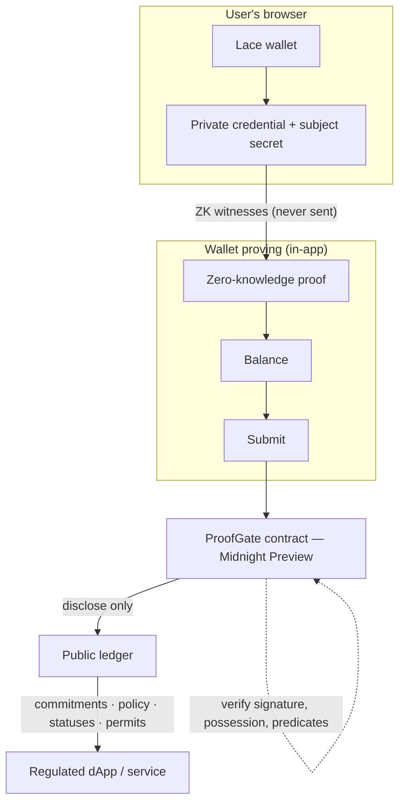
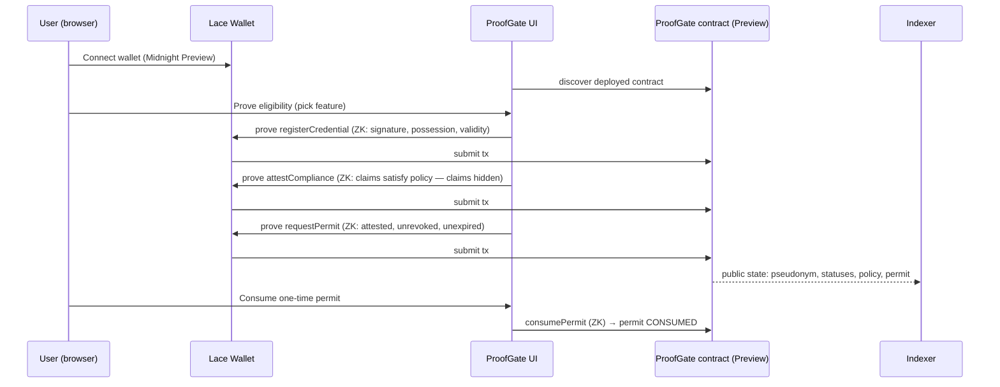

# ProofGate

**A privacy-preserving compliance gateway on the Midnight blockchain.**

ProofGate lets a user prove they are *eligible* — "I am 18+, I am in an allowed
jurisdiction, I passed KYC, I hold an issuer-signed credential" — **without
proving *who* they are**. Every action is a zero-knowledge proof; the Midnight
ledger only ever stores hash commitments, policy parameters and status flags.

[](https://github.com/sudha16-sketc/ProofGate/actions/workflows/ci.yml)
[](https://docs.midnight.network/)
[](https://shields.io/)
[](https://shields.io/)
[](https://shields.io/)
[](https://shields.io/)

---

## Overview

Regulated services must verify that users satisfy compliance requirements —
minimum age, KYC/AML clearance, jurisdiction. Today that means sharing identity
documents and exact personal attributes with every service. ProofGate decouples
**eligibility** from **identity**: a KYC issuer signs a credential (claims about
the user), the user keeps that credential privately in their Midnight wallet,
and the ProofGate contract verifies — **in zero knowledge** — that the signed
claims satisfy the currently active compliance policy. Eligible users receive a
**one-time permit** that third-party dApps can verify and consume.

This is an application project (not a template). See
[PROJECT_GUIDE.md](./PROJECT_GUIDE.md) for the full architecture and data-flow
write-up, [docs/PRODUCT_PROPOSAL.md](./docs/PRODUCT_PROPOSAL.md) for the product
proposal, and [docs/DEMO_SCRIPT.md](./docs/DEMO_SCRIPT.md) for the demo video
script.

## Problem

- Users share sensitive data (ID, exact age, jurisdiction, KYC evidence) with
  every regulated service they touch.
- Each copy is an attack surface: databases leak, processors mishandle data,
  and users permanently lose control of their personal information.
- Services **do** need a trustworthy, enforceable answer to "is this user
  eligible?" — they do **not** need to know *who* the user is.

## Solution

ProofGate is a compliance gateway built on Midnight:

1. An **issuer** (KYC/AML provider) performs its checks off-chain and signs a
   private credential for the user.
2. The user keeps the signed credential **privately in their wallet**.
3. The **ProofGate smart contract** verifies, in zero knowledge, that the
   credential is genuine, current, and satisfies the *active compliance policy*
   (`age ≥ minimumAge`, `kycLevel ≥ requiredKycLevel`, jurisdiction in an
   allowed set).
4. Compliance converts into an **enforceable one-time permit** that regulated
   dApps verify and consume — while the user's identity, exact age,
   jurisdiction and signature never reach the ledger.

## How ProofGate Works

Three deliberately separated ZK circuit groups keep each circuit small:

1. **`registerCredential`** — identity enrollment. Proves the issuer signature,
   possession of the subject key, binding of every signed field, and current
   validity. Stores a commitment to the signed claims. **No policy evaluation.**
2. **`attestCompliance`** — selective disclosure. Proves the *enrolled* claims
   satisfy the *currently active* policy (age, KYC level, jurisdiction, schema
   + policy version) **without revealing them**.
3. **`requestPermit` / `consumePermit`** — cheap access control gated on the
   attested policy version and one-time permit consumption.

Registration never repeats when policy changes; compliance is re-proven per
policy version; permits are the enforceable one-shot authorization.

**Signature scheme** — Schnorr over Jubjub (embedded curve in BLS12-381 Fr),
verified **in-circuit**. The signed credential is an 18-slot, domain-separated
message covering: issuer identity, subject binding, credential id, age,
jurisdiction, KYC level, issue/expiry time, credential + policy versions and
the ProofGate instance domain (cross-contract replay protection).

## Architecture



### Component map

| Layer | Component | Responsibility |
|---|---|---|
| Contract | `contracts/proofgate.compact` | The ProofGate smart contract in Compact (12 provable + pure helper circuits) |
| Contract (compiled) | `managed/proofgate/` | Compiler output: `contract/` (TS bindings), `keys/` (prover/verifier keys), `zkir/` (ZK circuits) |
| Shared crypto | `src/schnorr.ts` | Schnorr-over-Jubjub credential signing/verification (off-chain mirror of the in-circuit scheme) |
| Shared SDK | `src/proofgate.ts` | Node-side private state model, demo credentials, witness builder, jurisdiction helpers |
| CLI | `src/cli.ts` | `info`, `set-policy`, `register-issuer`, `register-credential`, `attest-compliance`, `request-permit`, `consume-permit`, `demo` |
| CLI | `src/deploy.ts` | Non-interactive deploy (proves via the proof server) |
| CLI | `src/wallet.ts`, `src/network.ts` | Wallet SDK facade, network configs (`undeployed`/`preview`/`preprod`), BIP-39 wallet management |
| Web UI | `frontend/` | React app: connect wallet, credential, prove, permits, ledger, trust, admin, settings |
| Tests | `tests/proofgate.test.ts` | 46 headless contract tests (no Docker / proof server / network) |
| Tests | `tests/schnorr-prototype.test.ts` | 6 Schnorr prototype sanity tests |
| Infra | `compose.yml` | Local devnet: `midnight-node`, `indexer-standalone`, `proof-server` (optional) |

## Midnight Privacy Model

> This is the heart of the project. Be precise: ProofGate is **not** "hide the
> PII in the UI". The private values are first-class **witnesses** in the ZK
> circuits; they physically cannot appear in the public state, because the
> Compact contract only ever writes what it explicitly `disclose`s.

### What remains private?

- **Exact age** (`age`) — a signed `Uint<8>` witness. The circuit checks
  `age >= minimumAge`; the value itself is never disclosed.
- **Jurisdiction** (`jurisdiction`) — a signed 32-byte witness. The circuit
  checks membership in the allowed list; the value is never disclosed.
- **KYC evidence / identity documents** — checked off-chain by the issuer;
  ProofGate never sees them.
- **The credential signature** (`rx`, `ry`, `s`) — verified in-circuit
  (`s·G == R + e·P_I`); never written to the ledger.
- **The subject secret key** (`subjectSk`) — proves key possession via
  `subjectSk·G == subjectPk`; never leaves the wallet.
- **The issuer signing key** and the signed attribute slots.

### What becomes public?

Only values the contract explicitly `disclose`s:

- **Pseudonyms** — `subjectKey = persistentHash("ProofGateSubject:v1" ∥ domain ∥ pkX ∥ pkY)`.
  A domain-separated commitment: unlinkable across ProofGate instances.
- **Issuer ids** — `issuerId = persistentHash("ProofGateIssuer:v1" ∥ pkX ∥ pkY)`.
- **Credential ids** — the revocation identifier (chosen by the issuer).
- **Policy parameters** — active policy id/version, minimum age, required KYC
  level, required credential version, the jurisdiction *commitment*.
- **Status flags & time bounds** — subject/issuer/permit status, KYC level
  tier, `expiresAt`/`registeredAt`.
- **Permit records** — holder pseudonym, feature, policy id, status, expiry.
  Permit ids are salted hashes, so two permits for the same feature are
  unlinkable.

### What can a blockchain observer learn?

Honestly: that **some** contract interaction happened at a given time (the
transaction exists and its metadata/timing is visible), that the active policy
is what it is, that a subject registered/attested/obtained a permit, and the
public statuses above. A permit being issued means *some* anonymous holder
satisfied the policy.

### What can the observer NOT learn?

- Who the user is (the holder is a pseudonym commitment).
- The user's exact age or that their age is anything other than ≥ policy.
- The user's jurisdiction (only that it is in the allowed set).
- Any KYC evidence or the credential's private contents.
- The signature — it never appears on-chain.

### What does the smart contract verify?

In zero knowledge, for each circuit:

- **`registerCredential`**: the Schnorr signature verifies under a registered,
  active issuer key; the caller owns the signed subject key; every signed field
  is bound; the credential is valid now (not future/expired/revoked) and not
  already enrolled.
- **`attestCompliance`**: the *enrolled* claims (pinned by `claimCommitment`)
  satisfy the active policy — `age >= minimumAge`, `kycLevel >=
  requiredKycLevel`, jurisdiction in the policy's allowed set, credential and
  policy version match.
- **`requestPermit` / `consumePermit`**: the subject is active, attested for the
  active policy version, unrevoked, unexpired; the permit is held by the caller
  and consumed exactly once.

### Why is this different from ordinary on-chain KYC?

Ordinary on-chain KYC stores (or commits to) identity data on-chain, or relies
on a trusted oracle to whisper "verified". ProofGate:

- never stores the data — the ledger schema **cannot represent** identity,
  age or jurisdiction (verified by a test that inspects the public `Subject`
  shape);
- enforces policy **inside the contract**, not in a trusted server;
- is **selective-disclosure by construction**: the prover reveals only the
  outcome (a predicate over their claims), never the claims.

### Threat model / observer model

- **Adversary**: any party able to read the public ledger and transaction
  stream (indexer operator, node operator, block explorer, on-chain
  analytics).
- **Metadata caveat — read this**: privacy of the *input* does not imply
  metadata privacy. The adversary can see *that* a transaction occurred and
  when, the contract address, and the public policy/status values. They cannot
  learn the private inputs. Network-level and timing analysis are out of scope
  for this project.
- **Commitment caveat**: pseudonyms are unlinkable across ProofGate instances
  (different domains) and permits are salted, but within one instance, the same
  subject's permit and credential records are linkable to that subject's
  pseudonym — this is required so the contract can enforce ownership.
- **Trust**: the admin (contract deployer) can rotate keys and manage policy/
  issuer registries; issuers are a trusted third party for the *credential
  claims* (as in the real world), but ProofGate never trusts them to evaluate
  policy.

## Technology Stack

- **Language**: [Compact](https://docs.midnight.network/compact/writing)
  (0.23.0) — Midnight's smart-contract language with first-class private
  witnesses; compiled by `compactc` 0.31.1.
- **ZK proving**: Midnight's PLONK/UltraPLONK circuits (`.zkir`), proving keys
  (`.prover`) and verifier keys (`.verifier`); Schnorr-over-Jubjub verified
  in-circuit.
- **Runtime**: `@midnight-ntwrk/compact-runtime` 0.16.0,
  `@midnight-ntwrk/onchain-runtime-v3` 3.0.0 (single-copy enforced).
- **SDK**: Midnight.js 4.1.1 (`midnight-js-contracts`,
  `-fetch-zk-config-provider`, `-indexer-public-data-provider`,
  `-network-id`, `-types`, `-utils`, `-protocol`), Wallet SDK 1.2.0.
- **Frontend**: React 19, TypeScript 5.9, Vite 7 (WASM/ESM plugins).
- **Tests**: Vitest 4 — headless, no Docker / proof server / network.
- **Node**: ≥ 22.

## User Flow



## Smart Contract

`contracts/proofgate.compact` — see the header comment for the full slot layout
and the [contract-info.json](./managed/proofgate/compiler/contract-info.json)
for generated types.

| Circuit | Kind | Purpose |
|---|---|---|
| `adminKey`, `issuerId`, `subjectKey` | pure | domain-separated commitments |
| `registerCredential` | ZK | identity enrollment (signature + possession + validity) |
| `attestCompliance` | ZK | selective-disclosure policy check (claims stay hidden) |
| `requestPermit` | ZK | one-time authorization (unlinkable id) |
| `consumePermit` | ZK | spend the permit exactly once |
| `setPolicy`, `registerIssuer`, `setIssuerStatus`, `revokeCredential`, `unrevokeCredential`, `setSubjectStatus`, `rotateAdmin`, `revokePermit` | ZK | admin-governed policy/issuer/lifecycle |

Key ledger fields: `contractDomain`, `adminPk`, `activePolicyId/Version`,
`minimumAge`, `requiredKycLevel`, `requiredCredentialVersion`,
`jurisdictionCommitment`, `issuers`, `subjects`, `revoked`, `permits`, `seq`.

## Tests

```bash
npm test
```

**Result (2026-08-09): 52 passing tests, 2 files.**

- `tests/proofgate.test.ts` (46) — headless contract tests against the compiled
  contract via the Compact runtime: pure-circuit commitment logic; the full
  admin/user lifecycle with every meaningful rejection path (bad signature,
  possession, unregistered issuer, under-age, insufficient KYC, unsupported
  schema/policy version, wrong jurisdiction, revoked/expired credentials,
  consumed/revoked permits, admin rotation); and **privacy** tests asserting
  private witnesses never appear in the public ledger or public proof data.
- `tests/schnorr-prototype.test.ts` (6) — Schnorr prototype sanity checks.

See [docs/screenshots/tests.png](./docs/screenshots/tests.png) for the
screenshot of the passing run.

## CI/CD

Workflow: [`.github/workflows/ci.yml`](./.github/workflows/ci.yml)

[](https://github.com/sudha16-sketc/ProofGate/actions/workflows/ci.yml)

- **contract job**: installs the official Midnight Compact compiler (0.31.1)
  via `midnightntwrk/setup-compact-action`, recompiles the Compact contract
  (`--skip-zk` for CI speed), and verifies the committed compiled artifacts.
- **test job**: `npm ci` → `npm run typecheck` → `npm test` → `npm --prefix
  frontend ci` → `npm run frontend:build`.

> The badge reflects real GitHub Actions runs. The first run happens once this
> branch is pushed to the repository.

## Deployment

- **Network:** [Midnight Preview](https://docs.midnight.network/) — the dApp is
  **Preview-first** (defaults to `preview`, in-wallet proving, no Docker).
- **Contract address (deployed):**
  `c1a42ae0c36cc5a2c420cc5c84d3b1a4147f3427fd4514c99835d5918e6d1f67`
  (deployed 2026-08-08; see `.midnight-state.json`, which is git-ignored).
- **Frontend config:** `frontend/.env.example` already pins
  `VITE_NETWORK_ID=preview`, the contract address and the official Preview
  indexer.

### Run it locally

```bash
npm install
cp frontend/.env.example frontend/.env.local
npm run frontend:dev      # http://127.0.0.1:8080 — connect your Lace wallet on Midnight Preview
```

The browser path proves **in-wallet** and needs no node, indexer, proof server,
or Docker. The CLI (`npm run cli`) proves via a locally-run official proof
server — there is no Midnight-hosted public proof server.

### Live demo

> **Live demo URL: [MANUAL ACTION REQUIRED]** — host the built frontend
> (e.g. Vercel, Netlify, or GitHub Pages — a static Vite build) and paste the
> URL here. The build is Preview-first and self-contained:
> `npm --prefix frontend run build` → deploy `frontend/dist/`.

## Demo Video

> **Demo video: [MANUAL ACTION REQUIRED]** — record per
> [docs/DEMO_SCRIPT.md](./docs/DEMO_SCRIPT.md) (60 s: connect → private
> credential → generate proof → contract verifies → "Eligible", with the
> private values shown to stay private), upload, and paste the public URL here.

## Product Proposal

[`docs/PRODUCT_PROPOSAL.md`](./docs/PRODUCT_PROPOSAL.md) — problem, target
users, solution, why Midnight, privacy model, user journey, architecture,
smart-contract functionality, ZK/private computation, expected impact, demo
plan and roadmap. **Note:** the exact idea-list entry is
**[MANUAL CONFIRMATION REQUIRED]** — the idea list is not in the repository and
we do not claim organizer approval.

## Screenshots

| Capture | File |
|---|---|
| Test suite output (52 passing) | [`docs/screenshots/tests.png`](./docs/screenshots/tests.png) |
| Web UI | *(to be added)* |

## Security / Privacy Considerations

- **No secrets in the repo.** Wallets (`.<midnight-state.json`,
  `.midnight-wallet-state/`, `midnight-level-db/`) and `.env` files are
  git-ignored; only public network configuration lives in
  `frontend/.env.example`.
- **Single runtime copy.** `@midnight-ntwrk/onchain-runtime-v3` is pinned via
  `overrides`; two copies break `StateValue` (see
  `frontend/vite.config.ts` dedupe).
- **Deterministic demo admin.** The demo derives the admin secret from the
  wallet seed (`deriveSecret(seed, 'admin-sk')`); the CLI and deploy must use
  the same seed.
- **Privacy invariants are tested**, not asserted: the suite inspects the
  public ledger schema and public transcript bytes for any private value.
- **Fixed demo issuer key (sk = 42)** is a demo convenience shared by CLI,
  tests and browser — documented; a real deployment uses a real issuer.
- Metadata privacy limits (timing, linkage within an instance) are documented
  in the Privacy Model above.

## Future Improvements

- Real issuer onboarding flow (credential issuance from a production KYC
  provider).
- Multi-policy / multi-feature permit design and permit delegation.
- Encrypted off-chain metadata references (private credentials stored as
  encrypted payloads).
- Mainnet deployment; independent ZK/crypto audit of the circuit code.

## License

Apache-2.0. See [LICENSE](./LICENSE).
